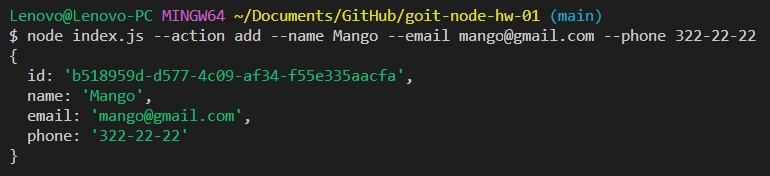

# goit-node-js-homeworks
## (01-node-basics)
> ### Получаем и выводим весь список контактов в виде таблицы (console.table)
```
node index.js --action list
```

<a href="https://monosnap.com/file/CFVFgCBXPHDHt9nGJV0CSRfAfabIB6" rel="noopener noreferrer" target="_blank"></a>
> ### Получаем контакт по id
```
node index.js --action get --id 5
```

<a href="https://monosnap.com/file/L9sgv3E9kRLhc0HrHgm28SbMbXYZfb" rel="noopener noreferrer" target="_blank"></a>


> ### Добавялем контакт
```
node index.js --action add --name Mango --email mango@gmail.com --phone 322-22-22
```

<a href="https://monosnap.com/file/BUyce11tKEtjS5d7XITZ6Qu2kgi0Oy" rel="noopener noreferrer" target="_blank"></a>


> ### Удаляем контакт
```
node index.js --action remove --id=3
```

<a href="https://monosnap.com/file/D2VCBK8cGYMb5XyyMPPI4dtcqrhaxm" rel="noopener noreferrer" target="_blank"></a>
